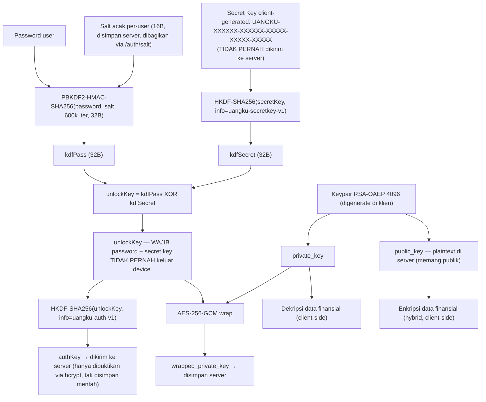
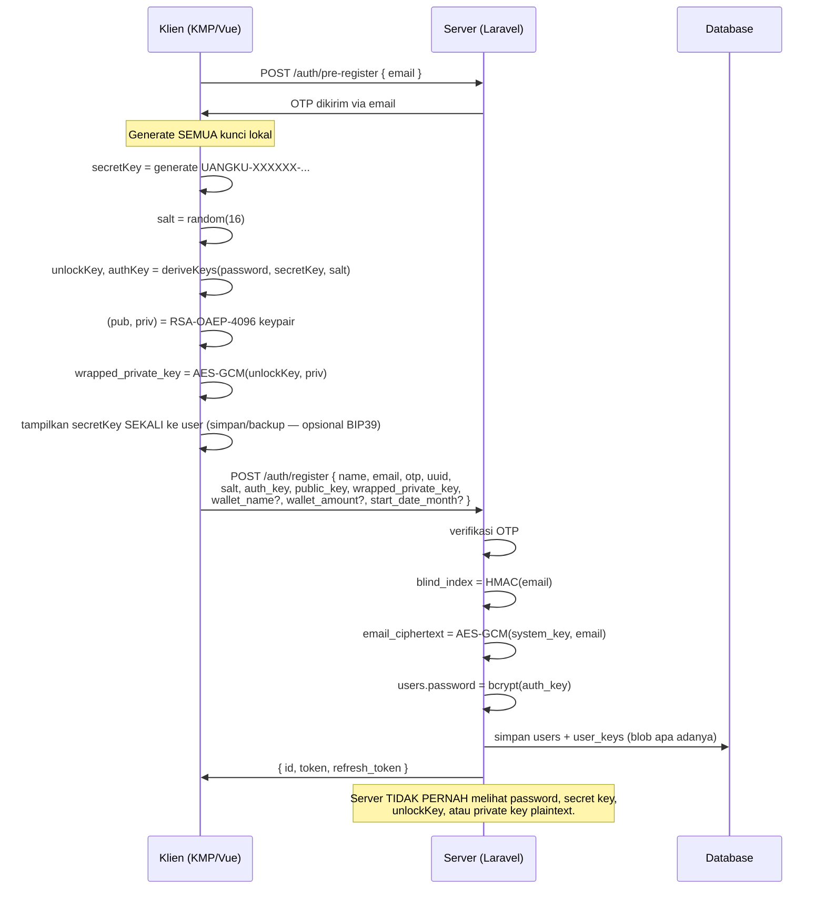
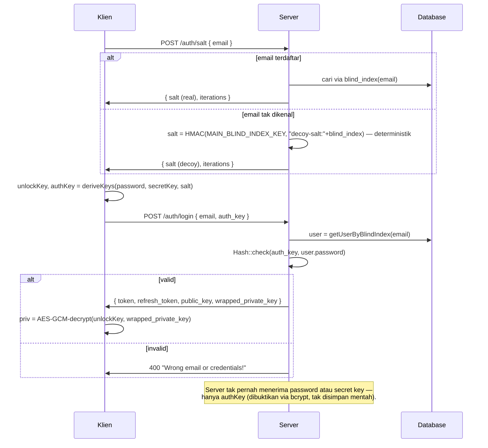
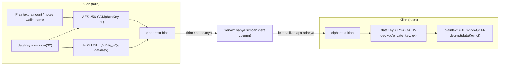
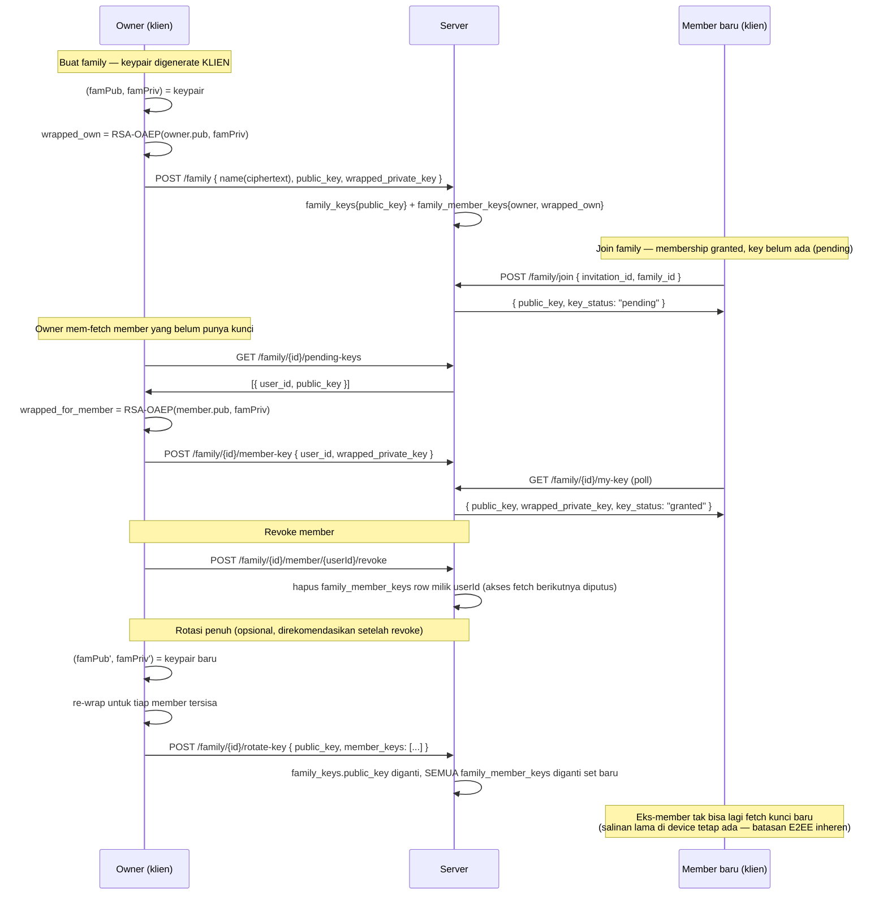
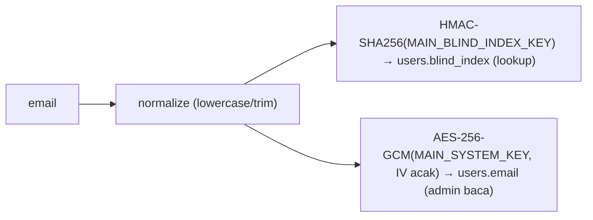

# Uangku Zero-Knowledge Encryption — Technical Specification

**Status:** Shipped on `main` — this document reflects the current backend contract, not a proposal
**Audience:** Backend (Laravel), Client KMP (Android/iOS), Client Web (Vue JS), Security reviewer

---

## Glosarium (Istilah Teknis untuk Awam)

Dokumen ini penuh istilah kriptografi. Kalau baru pertama kali baca, mulai dari sini dulu sebelum masuk ke bagian teknis.

| Istilah | Penjelasan Awam |
|---|---|
| **Zero-Knowledge (ZK)** | Desain sistem di mana pihak server **secara fisik tidak bisa** membaca data kamu, walau mau — karena kuncinya memang tidak pernah dipegang server. Bukan sekadar janji "kami tidak akan mengintip", tapi memang tidak mungkin. |
| **End-to-End Encryption (E2EE)** | Data dikunci di device kamu, dan hanya bisa dibuka lagi di device tujuan. Semua yang di tengah — termasuk server Uangku — cuma meneruskan data yang terkunci, tanpa bisa membacanya. |
| **Plaintext vs Ciphertext** | *Plaintext* = data asli yang bisa dibaca (mis. "Rp500.000"). *Ciphertext* = versi acak/terkunci dari data itu setelah dienkripsi — kelihatannya seperti karakter acak tak bermakna. |
| **Encryption key (kunci enkripsi)** | Ibarat kunci fisik untuk gembok — deretan data rahasia yang dipakai untuk mengunci (enkripsi) dan membuka (dekripsi) data. |
| **Password vs Secret Key** | *Password* = yang diketik user saat login, seperti biasa. *Secret Key* (`UANGKU-XXXX...`) = kode acak panjang yang digenerate otomatis saat daftar, semacam "kode cadangan" yang **wajib disimpan sendiri** — hilang salah satu dari keduanya, data tidak bisa dibuka lagi. |
| **2SKD (Two-Secret-Key Derivation)** | Proses menggabungkan password + Secret Key jadi satu kunci enkripsi yang sesungguhnya. Analoginya seperti brankas bank yang butuh **dua kunci berbeda** dari dua pihak sebelum bisa dibuka — satu saja tidak cukup. |
| **Salt** | Data acak tambahan yang dicampur ke password sebelum diproses, supaya dua orang dengan password sama tetap menghasilkan kunci yang berbeda. Mencegah penyerang memakai tabel hasil hitung-hitungan siap pakai (*rainbow table*). |
| **PBKDF2 ("password stretching")** | Algoritma yang **sengaja dibuat lambat** saat mengubah password jadi kunci enkripsi (diulang 600.000 kali). Tujuannya: kalau data bocor, penyerang butuh waktu sangat lama untuk mencoba menebak-nebak password. |
| **HKDF** | Cara mengambil satu kunci rahasia dan "mencabangkannya" secara aman jadi beberapa kunci turunan dengan fungsi berbeda-beda, tanpa kunci-kunci itu saling bocor satu sama lain. |
| **AES-256-GCM** | Algoritma enkripsi simetris (kunci yang sama dipakai untuk mengunci maupun membuka) yang juga otomatis mendeteksi kalau ciphertext-nya diutak-atik/dirusak orang lain. |
| **RSA-OAEP** | Algoritma enkripsi asimetris — pakai **sepasang kunci berbeda**: public key untuk mengunci, private key (pasangannya) untuk membuka. |
| **Public key vs Private key** | *Public key* ibarat lubang kotak surat — siapa saja boleh tahu dan memasukkan surat (mengenkripsi data untukmu). *Private key* ibarat kunci rumahmu untuk membuka kotak surat itu dan membaca isinya (dekripsi) — hanya kamu yang boleh punya. |
| **IV (Initialization Vector)** | "Bumbu acak" tambahan yang dipakai setiap kali proses enkripsi berjalan, supaya data yang sama dienkripsi dua kali tetap menghasilkan ciphertext yang kelihatan berbeda. |
| **Bcrypt / hashing** | Proses pengacakan **satu arah** — tidak bisa dibalik ke bentuk asli, hanya bisa dicocokkan ("apakah input ini menghasilkan hash yang sama?"). Dipakai untuk menyimpan bukti login/PIN tanpa menyimpan nilai aslinya. |
| **HMAC** | Cara membuat "sidik jari" dari sebuah data memakai kunci rahasia. Dipakai untuk verifikasi data, atau untuk membuat indeks pencarian tanpa membocorkan data aslinya (lihat *Blind Index*). |
| **Blind Index** | "Sidik jari" dari data terenkripsi (mis. email) yang dipakai server untuk mencari data yang cocok di database — tanpa server pernah tahu isi aslinya. |
| **unlockKey** | Kunci utama yang hanya bisa dihasilkan kalau kamu tahu password **DAN** Secret Key sekaligus. Dipakai membuka private key kamu, dan **tidak pernah** dikirim ke server. |
| **authKey** | "Bukti" turunan dari unlockKey yang dikirim ke server saat login. Server bisa mengecek bukti ini valid atau tidak, tanpa pernah tahu bahan-bahan yang dipakai membuatnya. |
| **wrapped_private_key** | Private key kamu, tapi dalam kondisi terkunci/terenkripsi — aman disimpan di server karena tanpa unlockKey, data ini tidak berguna sama sekali. |
| **Hybrid encryption** | Gabungan dua teknik: enkripsi simetris yang cepat untuk mengunci data sebenarnya, plus enkripsi asimetris untuk mengunci kunci simetris tadi dengan aman. |
| **CSPRNG** | Generator angka acak yang kualitasnya cukup aman untuk kebutuhan kriptografi (bukan "acak" biasa yang bisa ditebak polanya). |
| **Threat model** | Daftar "kita melindungi dari siapa/apa saja" yang jadi dasar keputusan desain keamanan sistem. |
| **User enumeration** | Teknik penyerang mencoba menebak/memastikan email mana saja yang sudah terdaftar di sistem, biasanya lewat respons server yang berbeda-beda. Makanya endpoint `/auth/salt` sengaja memberi jawaban "seolah-olah normal" walau emailnya tidak terdaftar. |
| **Key rotation** | Mengganti kunci enkripsi lama dengan yang baru secara berkala, atau setelah ada indikasi kunci lama bocor. |
| **OTP (One-Time Password)** | Kode sekali pakai (biasanya dikirim ke email) untuk memastikan kamu benar-benar pemilik akun sebelum melakukan aksi sensitif seperti ganti password. |

---

## 1. Tujuan & Prinsip

Uangku bergerak dari model *server-assisted encryption* menuju **Zero-Knowledge (ZK) / End-to-End Encryption (E2EE)**
dengan **dua faktor** ala 1Password:

> Server hanya menyimpan **blob terenkripsi** dan memverifikasi bukti kepemilikan kredensial. Server **tidak pernah**
> memegang password, secret key (`UANGKU-XXXX`), private key plaintext, atau data finansial yang bisa dibaca.

**Ciri khas produk dipertahankan:** setiap akun punya **Secret Key** berformat `UANGKU-XXXXXX-XXXXXX-XXXXX-XXXXX-XXXXX`,
digenerate **di klien**. Data dienkripsi dengan kunci yang hanya bisa diturunkan dari **password DAN secret key
sekaligus** (Two-Secret-Key Derivation / 2SKD) — kehilangan salah satu faktor membuat data tidak bisa dibuka lagi.

**Satu pengecualian eksplisit:** **email** dienkripsi dengan kunci milik sistem agar admin/customer-support dapat
membacanya. Seluruh field lain (nama wallet, saldo, jumlah & catatan transaksi, private key, family key) bersifat ZK
penuh.

### Perbandingan dengan referensi industri

| Aspek                 | Internxt                                | 1Password                        | Uangku (implementasi)            |
|-----------------------|-----------------------------------------|----------------------------------|----------------------------------|
| Lokasi kripto         | Klien                                   | Klien                            | Klien                            |
| Faktor derivasi kunci | Password saja (+ mnemonic device-bound) | **Password + Secret Key (2SKD)** | **Password + Secret Key (2SKD)** |
| Login                 | Challenge-based                         | Challenge-based                  | Challenge-based (`authKey`)      |
| Cipher data           | AES-GCM (AEAD)                          | AES-GCM                          | AES-256-GCM (AEAD)               |
| Sharing               | Wrap ke public key penerima             | —                                | Per-recipient wrap (family)      |
| Metadata              | Minimal di server                       | —                                | Email dikecualikan (by design)   |

---

## 2. Threat Model

**Yang dilindungi:** kompromi database, kompromi server aplikasi, admin/insider yang jahat, snapshot backup, network
sniffing.

**Asumsi:** device klien yang sudah login dianggap tepercaya (kunci ada di memori/keystore device). TLS tetap wajib
untuk transport.

**Kesimpulan:** bila server/DB bocor sepenuhnya, penyerang hanya mendapat: blob terenkripsi, `bcrypt(authKey)` (bukan
authKey itu sendiri, apalagi password/secret key), dan email (yang memang sengaja bisa dibuka sistem). Tanpa **password
DAN secret key** milik user, data finansial tak bisa dibuka — kompromi salah satu faktor saja tidak cukup.

---

## 3. Hierarki Kunci — Two-Secret-Key Derivation (2SKD)



**Ringkas:**

- **`unlockKey`** hanya bisa diturunkan bila punya **password DAN secret key**. Ia membungkus `private_key` dan **tidak
  pernah** keluar dari device.
- **`authKey`** adalah bukti kepemilikan kedua faktor — server menyimpan **`bcrypt(authKey)`** di kolom
  `users.password` (kolom lama, direpurpose; lihat §7). Server tak pernah tahu itu berasal dari password+secretKey,
  hanya tahu ia adalah "sesuatu yang di-bcrypt-check".
- **Tidak ada `seed`/mnemonic terpisah** — secret key itu sendiri sudah berperan sebagai faktor high-entropy kedua;
  keypair digenerate langsung di klien saat registrasi.
- **Kehilangan salah satu faktor = data hilang permanen.** Ini konsisten dengan batasan nyata semua produk E2EE (
  Internxt, 1Password) — server tidak bisa membantu memulihkan kunci yang tidak pernah ia miliki.

---

## 4. Spesifikasi Primitif Kripto

| Fungsi              | Algoritma          | Parameter                                                                       | Dipakai di                                                                                                                |
|---------------------|--------------------|---------------------------------------------------------------------------------|---------------------------------------------------------------------------------------------------------------------------|
| Password stretching | PBKDF2-HMAC-SHA256 | 600.000 iterasi (`EncryptionHelper::PBKDF2_ITERATIONS`), output 32B             | Klien                                                                                                                     |
| Domain separation   | HKDF-SHA256        | `info` = `uangku-secretkey-v1` / `uangku-auth-v1` / `uangku-enc-v1`, output 32B | Klien (+ server: `EncryptionHelper::hkdf()` untuk test vectors)                                                           |
| Enkripsi simetris   | AES-256-GCM        | IV 12 byte acak, tag 16 byte                                                    | Klien (wrap private key, enkripsi data finansial) + Server (`EncryptionHelper::aesGcmEncrypt/Decrypt`, HANYA untuk email) |
| Enkripsi asimetris  | RSA-OAEP-SHA256    | modulus 4096-bit                                                                | Klien saja (server tidak lagi generate/encrypt/decrypt RSA sama sekali)                                                   |
| Blind index (email) | HMAC-SHA256        | kunci = `MAIN_BLIND_INDEX_KEY`                                                  | Server (`EncryptionHelper::blindIndex()`)                                                                                 |
| Verifier hash       | bcrypt             | pepper = `MAIN_SALT_KEY`                                                        | Server (`EncryptionHelper::hashSecret/validateSecret()` — authKey & PIN)                                                  |
| Random              | CSPRNG             | —                                                                               | Klien & server (`random_bytes`)                                                                                           |

### 4.1 Format ciphertext AES-256-GCM (server-side, email only)

```
┌─────────┬──────────┬───────────────┬──────────┐
│ ver(1B) │ iv (12B) │ ciphertext(N) │ tag(16B) │
└─────────┴──────────┴───────────────┴──────────┘
ver = 0x02  (EncryptionHelper::CIPHER_VERSION_GCM)
```

Base64-encoded as a whole. Klien bebas memilih format containernya sendiri untuk data finansial (server hanya menyimpan
string opaque) — **rekomendasi**: pakai format yang sama (ver‖iv‖ct‖tag) demi konsistensi tooling, plus wrapper hybrid
berikut untuk field besar:

```json
{
    "v": 2,
    "ek": "base64(RSA-OAEP(dataKey))",
    "ct": "base64(ver‖iv‖ciphertext‖tag)"
}
```

### 4.2 Kontrak derivasi kunci (WAJIB identik di semua klien)

```
kdfPass   = PBKDF2-HMAC-SHA256(NFC(password), salt, iterations=600000, dkLen=32)
kdfSecret = HKDF-SHA256(ikm=secretKey, salt="user-salt", info="uangku-secretkey-v1", L=32)
unlockKey = kdfPass XOR kdfSecret
authKey   = base64(HKDF-SHA256(ikm=unlockKey, info="uangku-auth-v1", L=32))
```

`iterations` didapat dari `POST /auth/salt` (parameter-driven, bisa dinaikkan tanpa memecah klien lama).

**Referensi implementasi PHP** (dipakai server untuk simulasi klien di seeder/test — lihat
`database/seeders/UserSeeder.php` dan `tests/Feature/Api/AuthControllerTest.php::deriveAuthKey()`):

```php
$kdfPass   = EncryptionHelper::pbkdf2($password, $salt, EncryptionHelper::PBKDF2_ITERATIONS, 32);
$kdfSecret = EncryptionHelper::hkdf($secretKey, 'uangku-secretkey-v1', 32, 'user-salt');
$unlockKey = $kdfPass ^ $kdfSecret;
$authKey   = base64_encode(EncryptionHelper::hkdf($unlockKey, 'uangku-auth-v1', 32));
```

---

## 5. Alur Registrasi (Zero-Knowledge)



**Implementasi:** `AuthServiceImplement::register()`, `AuthController::store()`.

---

## 6. Alur Login (Challenge-Based)



**Implementasi:** `AuthServiceImplement::login()` / `getSalt()`, `AuthController::login()` / `salt()`.

**Catatan desain penting:** kolom `users.password` **direpurpose** untuk menyimpan `bcrypt(authKey)`, BUKAN
`bcrypt(password mentah)`. Ini memanfaatkan kembali mekanisme `Hash::check()` Laravel tanpa perlu menulis custom Auth
Provider — secara fungsional identik, karena `authKey` sudah membuktikan kepemilikan *kedua* faktor sebelum pernah
sampai ke server.

---

## 7. Ganti Kredensial & Pemulihan

Karena `authKey` = `f(password, secretKey)`, **mengganti password DAN mengganti secret key adalah operasi yang sama
persis** dari sudut pandang server (keduanya cuma menukar `salt` + `bcrypt(authKey)` + `wrapped_private_key`). Endpoint
terkonsolidasi:

### 7.1 Ganti kredensial (authenticated, tidak kehilangan data)

`POST /auth/pre-change-password` (mulai sesi OTP) → `POST /auth/change-password`:

```
{ old_auth_key, new_salt, new_auth_key, new_wrapped_private_key, otp, uuid }
```

Klien **masih punya** `unlockKey` lama (sedang login) → bisa dekripsi `private_key` lama & re-wrap dengan `unlockKey`
baru. **Tidak ada data yang hilang.**

### 7.2 Lupa password (`forgot-password` / `reset-password`)

```
{ email, otp, uuid, new_salt, new_auth_key, new_public_key, new_wrapped_private_key }
```

Karena klien **tidak bisa** membuka `wrapped_private_key` lama tanpa password lama, pemulihan ini **mengganti seluruh
keypair** — data lama yang terenkripsi dengan kunci lama **tidak bisa dibaca lagi**. Ini bukan bug — ini batasan jujur
E2EE yang sama dengan Internxt/1Password: server tidak bisa memulihkan apa yang tidak pernah ia punya kuncinya.

**Implementasi:** `AuthServiceImplement::changeCredentials()` / `resetCredentials()`.

---

## 8. Enkripsi Data Finansial (hybrid AES-GCM, client-side)



Server **tidak melakukan enkripsi/dekripsi apa pun** di sini — `WalletServiceImplement::createWallet()`/`updateWallet()`
menerima `$name`/`$amount` sebagai ciphertext client dan menyimpannya apa adanya. `AuthController::store()` menerima
`wallet_name`/`wallet_amount` opsional (ciphertext) untuk wallet default; bila kosong, klien buat wallet belakangan
lewat `POST /wallet`.

**Keterbatasan yang diketahui (didokumentasikan, bukan disembunyikan):**

- **Pencarian transaksi** (`note LIKE '%search%'`) tidak berfungsi atas ciphertext — hanya cocok bila klien
  mengimplementasikan pendekatan lain (mis. tag ter-hash).
- **Deteksi nama wallet duplikat** (`isNameExist`) hanya mendeteksi ciphertext yang byte-identik, bukan plaintext yang
  sama — konsekuensi inheren enkripsi non-deterministik di klien.

---

## 9. Family Sharing (per-recipient) & Rotasi



**Skema:** `family_keys(id, family, public_key)` — HANYA public key, tanpa private key/secret key bersama.
`family_member_keys(id, family, users, wrapped_private_key)` — **satu baris per member**, di-wrap ke public key
masing-masing. Tidak ada lagi konsep "family secret key" yang dibagikan manusia-ke-manusia.

**Implementasi:** `FamilyServiceImplement` (`createFamily`, `responseInvitation`, `getPendingMembers`, `grantMemberKey`,
`getMyMemberKey`, `rotateKey`, `revokeMember`), `FamilyController`, endpoint di `routes/api.php`.

---

## 10. Pengecualian Email (admin-decryptable)

Email adalah satu-satunya field yang boleh dibuka server (untuk customer support).

- **Blind index** untuk lookup & login: `blind_index = HMAC-SHA256(MAIN_BLIND_INDEX_KEY, normalize(email))` — kolom
  `users.blind_index` (unique, indexed). Deterministik → `WHERE blind_index = ?` cepat, tanpa IV statis pada kolom
  `email`.
- **Nilai tersimpan** untuk dibaca admin: `email = AES-256-GCM(MAIN_SYSTEM_KEY, email)` dengan **IV acak** setiap kali (
  `EncryptionHelper::encryptEmail`/`decryptEmail`) — ini memperbaiki kelemahan lama (static IV → equality leak).
- **Category/sub-category** juga memakai primitif yang sama (`encryptSystem`/`decryptSystem`) untuk field terkait yang
  boleh dibaca admin (lihat `SubCategoriesRelationManager`).



`MAIN_SYSTEM_KEY` dan `MAIN_BLIND_INDEX_KEY` adalah kunci server yang **berbeda** (domain separation) — lihat
`.env.example`.

---

## 11. API Contract

| Endpoint                                | Request                                                                                                                        | Response                                                                      |
|-----------------------------------------|--------------------------------------------------------------------------------------------------------------------------------|-------------------------------------------------------------------------------|
| `POST /auth/pre-register`               | `{ email }`                                                                                                                    | OTP terkirim                                                                  |
| `POST /auth/register`                   | `{ name, email, otp, uuid, salt, auth_key, public_key, wrapped_private_key, wallet_name?, wallet_amount?, start_date_month? }` | `{ id, token, refresh_token }`                                                |
| `POST /auth/salt`                       | `{ email }` (throttle 20/menit)                                                                                                | `{ salt, iterations }`                                                        |
| `POST /auth/login`                      | `{ email, auth_key }` (throttle 10/menit)                                                                                      | `{ id, name, avatar, token, refresh_token, public_key, wrapped_private_key }` |
| `POST /auth/refresh-token`              | `{ refresh_token }`                                                                                                            | token baru                                                                    |
| `POST /auth/pre-change-password`        | (auth)                                                                                                                         | mulai sesi OTP                                                                |
| `POST /auth/change-password`            | `{ old_auth_key, new_salt, new_auth_key, new_wrapped_private_key, otp, uuid }`                                                 | ok                                                                            |
| `POST /auth/forgot-password`            | `{ email }`                                                                                                                    | mulai sesi OTP                                                                |
| `POST /auth/reset-password`             | `{ email, otp, uuid, new_salt, new_auth_key, new_public_key, new_wrapped_private_key }`                                        | ok                                                                            |
| `POST /family`                          | `{ name, public_key, wrapped_private_key }`                                                                                    | family + key info                                                             |
| `POST /family/join`                     | `{ invitation_id, family_id }`                                                                                                 | `{ public_key, wrapped_private_key?, key_status }`                            |
| `GET /family/{id}/my-key`               | —                                                                                                                              | `{ public_key, wrapped_private_key?, key_status }`                            |
| `GET /family/{id}/pending-keys` (admin) | —                                                                                                                              | `[{ user_id, public_key }]`                                                   |
| `POST /family/{id}/member-key` (admin)  | `{ user_id, wrapped_private_key }`                                                                                             | ok                                                                            |
| `POST /family/{id}/rotate-key` (admin)  | `{ public_key, member_keys: [{user_id, wrapped_private_key}] }`                                                                | ok                                                                            |
| `POST /wallet`                          | `{ name, amount, family_id? }` (ciphertext)                                                                                    | wallet                                                                        |
| `POST /auth/pin/verify`                 | `{ pin }` (throttle 5/menit)                                                                                                   | ok                                                                            |
| `POST /auth/pin/forgot`                 | `{ auth_key }`                                                                                                                 | mulai sesi OTP                                                                |

Semua field kripto dikirim sebagai string base64 (kecuali `wrapped_private_key`/ciphertext data finansial yang formatnya
bebas ditentukan klien, lihat §4.1).

---

## 12. Tanggung Jawab Server (state final)

| Data                                 | Bentuk di server                                        | Server bisa baca?                            |
|--------------------------------------|---------------------------------------------------------|----------------------------------------------|
| Password                             | — (tak pernah dikirim)                                  | ❌                                            |
| Secret Key (`UANGKU-XXXX`)           | — (tak pernah dikirim)                                  | ❌                                            |
| authKey                              | `bcrypt(authKey)` di `users.password`                   | ❌                                            |
| unlockKey                            | — (tak pernah keluar device)                            | ❌                                            |
| private_key                          | `wrapped_private_key` (AES-GCM client-side)             | ❌                                            |
| public_key                           | plaintext                                               | (publik)                                     |
| wallet/txn/saldo                     | ciphertext hybrid client-side                           | ❌                                            |
| family private key                   | `wrapped_private_key` per-member                        | ❌                                            |
| **email**                            | AES-256-GCM (`MAIN_SYSTEM_KEY`, IV acak) + blind_index  | ✅ **(satu-satunya pengecualian, by design)** |
| category/sub-category (admin-facing) | AES-256-GCM (`MAIN_SYSTEM_KEY`)                         | ✅ (non-finansial, admin-managed)             |
| refresh token                        | SHA-256 hash                                            | ❌                                            |
| PIN                                  | bcrypt (unlock lokal/gating aksi, bukan kunci enkripsi) | ❌ (hash only)                                |

---

## 13. Panduan Implementasi Klien

### 13.1 Kotlin Multiplatform (Android/iOS)

- **KDF/HKDF/HMAC/AES-GCM:** library kripto multiplatform (mis. `cryptography-kotlin`) → JCA di Android,
  CommonCrypto/Security.framework di iOS.
- **RSA-OAEP:** JCA (`RSA/ECB/OAEPWithSHA-256AndMGF1Padding`) / `SecKeyCreateEncryptedData` (`rsaEncryptionOAEPSHA256`).
- **Penyimpanan:** Android Keystore / iOS Keychain untuk cache `unlockKey` (dibuka via PIN/biometrik lokal — server
  tidak terlibat).
- **BIP39** opsional untuk menampilkan secret key sebagai frasa yang mudah dibackup.

### 13.2 Web (Vue JS)

- **WebCrypto (`crypto.subtle`)** untuk semua primitif: `deriveBits` (PBKDF2), HKDF, AES-GCM, RSA-OAEP.
- **600k iterasi PBKDF2** sebaiknya di **Web Worker** agar tidak blocking UI.
- **Penyimpanan:** IndexedDB untuk blob; hindari menyimpan `unlockKey` di storage biasa tanpa proteksi tambahan.

### 13.3 Kesamaan wajib

- Encoding password: **UTF-8 NFC**.
- Email normalize: lowercase + trim sebelum blind index (server melakukan ini di `EncryptionHelper::blindIndex`).
- Verifikasi hasil klien terhadap test vectors sebelum integrasi (§4.2) — pastikan `authKey` byte-identik dengan
  referensi PHP.

---

## 14. Catatan Migrasi & File Kritis

Greenfield → migrasi diedit langsung (tanpa dual-read/backward-compat shim).

- `app/Helpers/EncryptionHelper.php` — primitif final (§4).
- `app/Services/Auth/AuthService(Implement).php`, `app/Http/Controllers/Api/AuthController.php` —
  registrasi/login/ganti-kredensial ZK.
- `database/migrations/0001_01_01_000000_create_users_table.php` (+`blind_index`),
  `..._000004_create_user_keys_table.php` (`salt` ganti `hashed_key`),
  `2024_09_22_095203_create_family_keys_table.php` (hanya `public_key`),
  `2026_07_14_090000_create_family_member_keys_table.php` (baru).
- `app/Services/Family/FamilyService(Implement).php`, `app/Http/Controllers/Api/FamilyController.php` — per-recipient
  wrapping & rotasi.
- `app/Services/Wallet/WalletService(Implement).php` — berhenti enkripsi server-side.
- `app/Services/Pin/PinServiceImplement.php` — fix bug OTP-tidak-diverifikasi di `createPin`; `forgotPin` kini pakai
  `authKey`.
- `app/Repositories/UserSession/UserSessionRepositoryImplement.php` — refresh token di-hash SHA-256.
- `app/Http/Resources/BaseResponse.php`, `PaginationResponse.php` — enkripsi respons (`IS_NEED_ENCRYPT`) dihapus total.
- `.env.example` — `MAIN_SYSTEM_KEY`, `MAIN_BLIND_INDEX_KEY` baru; `MAIN_SECRET_KEY`/`MAIN_STATIC_IV` dihapus (
  obsolete).
- **Dihapus (superseded, bukan hilang fitur):** `UserService::preRegenerateSecretKey/generateSecretKey`,
  `OtpService::sendChangeSecretKey`, Console Commands `EncryptAsymmetricCommand`/`GenerateSecretKey` — lihat §7 untuk
  penggantinya.

---

## 15. Checklist Verifikasi

- [x] Unit test `EncryptionHelper` (16/16 pass): AES-GCM round-trip, tamper detection, PBKDF2/HKDF determinism, 2SKD
  dual-factor requirement, blind index, email round-trip.
- [x] Test "server tak pernah menerima password/secret key mentah" (`AuthControllerTest`).
- [x] Test dua-faktor: salah password saja ATAU salah secret key saja → login gagal (
  `test_login_fails_when_only_*_factor_is_wrong`).
- [x] `/auth/salt` mengembalikan salt deterministik untuk email tak dikenal (anti user-enumeration).
- [x] Full suite (`php artisan test`, termasuk test family/wallet yang butuh koneksi DB nyata) dijalankan di CI
  (`.github/workflows/tests.yml`) pada [PR #187](https://github.com/uangkuid/Uangku-BE/pull/187), sudah merged ke
  `main`.
- [ ] Test vectors byte-identik lintas KMP/Vue — perlu diverifikasi begitu klien mengimplementasikan §4.2.
- [ ] `./vendor/bin/pint` bersih di semua file yang disentuh (sudah diverifikasi selama implementasi).
