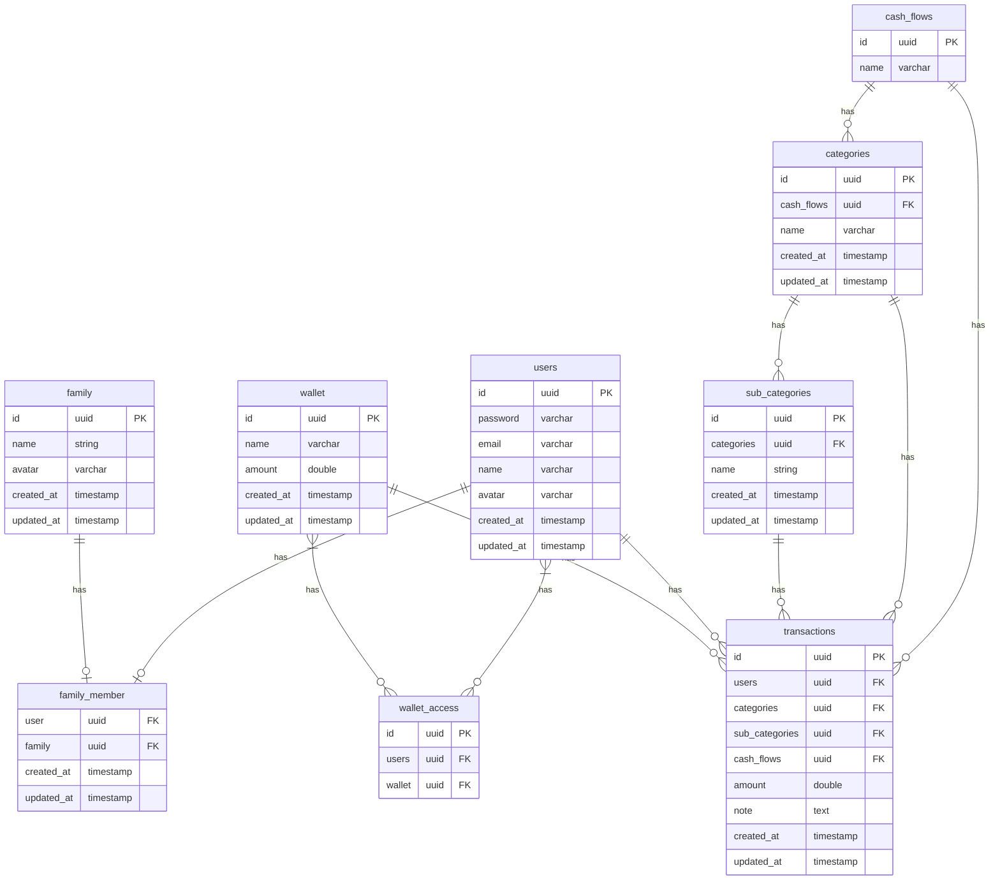

```mermaid
erDiagram
    
    cash_flows {
        id uuid PK
        name varchar
    }
    
    users {
        id uuid PK
        password varchar
        email varchar
        name varchar
        avatar varchar
        created_at timestamp
        updated_at timestamp
    }

    family {
        id uuid PK
        name string
        avatar varchar
        created_at timestamp
        updated_at timestamp
    }

    family_member {
        user uuid FK
        family uuid FK
        created_at timestamp
        updated_at timestamp
    }

    categories {
        id uuid PK
        cash_flows uuid FK
        name varchar
        created_at timestamp
        updated_at timestamp
    }

    sub_categories {
        id uuid PK
        categories uuid FK
        name string
        created_at timestamp
        updated_at timestamp
    }

    transactions {
        id uuid PK
        users uuid FK
        categories uuid FK
        sub_categories uuid FK
        cash_flows uuid FK
        amount double
        note text
        created_at timestamp
        updated_at timestamp
    }
    
    wallet {
        id uuid PK
        name varchar
        amount double
        created_at timestamp
        updated_at timestamp
    }
    
    wallet_access {
        id uuid PK
        users uuid FK
        wallet uuid FK
    }
    
    cash_flows ||--o{ categories : has
    cash_flows ||--o{ transactions : has

    categories ||--o{ sub_categories : has
    categories ||--o{ transactions : has

    sub_categories ||--o{ transactions : has

    users ||--o| family_member : has
    users ||--o{ transactions : has
    users }|--o{ wallet_access : has
    
    family ||--o| family_member : has

    wallet }|--o{ wallet_access : has
    wallet ||--o{ transactions : has
```
