```mermaid
erDiagram
    transaction_types {
        id uuid PK
        name varchar
        created_at timestamp
        updated_at timestamp
    }

    users {
        id uuid PK
        email varchar
        password varchar
        name text
        avatar varchar
        email_verified_at timestamp
        remember_token varchar
        status varchar
        suspended_at timestamp
        suspended_reason varchar
        created_at timestamp
        updated_at timestamp
        deleted_at timestamp
    }

    user_keys {
        id uuid PK
        users uuid FK
        public_key text
        private_key text
        hashed_key varchar
        hashed_pin varchar
        created_at timestamp
        updated_at timestamp
    }

    user_configs {
        id uuid PK
        users uuid FK
        is_pin_enabled boolean
        start_date_month text
        created_at timestamp
        updated_at timestamp
    }

    user_seasons {
        id uuid PK
        users uuid FK
        refresh_token text
        created_at timestamp
        updated_at timestamp
    }

    families {
        id uuid PK
        name text
        avatar varchar
        created_by uuid
        created_at timestamp
        updated_at timestamp
    }

    family_members {
        id uuid PK
        user uuid FK
        family uuid FK
        role enum
        status enum
        created_at timestamp
        updated_at timestamp
    }

    family_keys {
        id uuid PK
        family uuid FK
        public_key text
        private_key text
        hashed_key varchar
        created_at timestamp
        updated_at timestamp
    }

    categories {
        id uuid PK
        transaction_types uuid FK
        name varchar
        icon varchar
        created_at timestamp
        updated_at timestamp
    }

    sub_categories {
        id uuid PK
        categories uuid FK
        users uuid FK
        families uuid FK
        name varchar
        created_at timestamp
        updated_at timestamp
    }

    transactions {
        id uuid PK
        users uuid FK
        categories uuid FK
        sub_categories uuid FK
        transaction_type uuid FK
        amount text
        note text
        created_at timestamp
        updated_at timestamp
        deleted_at timestamp
    }

    wallets {
        id uuid PK
        name text
        amount text
        type enum
        status enum
        families uuid FK
        created_by uuid
        created_at timestamp
        updated_at timestamp
    }

    wallet_accesses {
        id uuid PK
        users uuid FK
        wallets uuid FK
        is_active boolean
        role enum
        created_at timestamp
        updated_at timestamp
    }

    wallet_transactions {
        id uuid PK
        wallets uuid FK
        access uuid FK
        transaction_type uuid FK
        transaction_id uuid FK
        updated_by uuid FK
        deleted_by uuid FK
        amount text
        created_at timestamp
        updated_at timestamp
        deleted_at timestamp
    }

    wallet_snapshots {
        id uuid PK
        wallet uuid FK
        wallet_transaction uuid FK
        balance text
        created_at timestamp
        updated_at timestamp
    }

    notifications {
        id uuid PK
        users uuid FK
        type varchar
        title text
        message text
        data json
        read_at timestamp
        created_at timestamp
        updated_at timestamp
    }

    staff_accounts {
        id uuid PK
        email varchar
        name varchar
        password varchar
        avatar varchar
        app_authentication_secret text
        app_authentication_recovery_codes text
        has_email_authentication boolean
        locale varchar
        created_at timestamp
        updated_at timestamp
    }

    staff_keys {
        id uuid PK
        staffs uuid FK
        public_key varchar
        private_key varchar
        hashed_key varchar
        hashed_pin varchar
    }

    system_configs {
        id uuid PK
        key varchar
        value text
        updated_by uuid FK
        created_at timestamp
        updated_at timestamp
    }

    feature_statuses {
        id uuid PK
        feature_name varchar
        is_enabled boolean
        updated_by uuid FK
        created_at timestamp
        updated_at timestamp
    }

    audit_logs {
        id uuid PK
        staff_id uuid FK
        action varchar
        target_type varchar
        target_id varchar
        description varchar
        metadata json
        ip_address varchar
        user_agent text
        created_at timestamp
    }

    roles {
        id bigint PK
        name varchar
        guard_name varchar
        created_at timestamp
        updated_at timestamp
    }

    permissions {
        id bigint PK
        name varchar
        guard_name varchar
        created_at timestamp
        updated_at timestamp
    }

    model_has_roles {
        role_id bigint FK
        model_type varchar
        model_id uuid
    }

    model_has_permissions {
        permission_id bigint FK
        model_type varchar
        model_id uuid
    }

    role_has_permissions {
        permission_id bigint FK
        role_id bigint FK
    }

    transaction_types ||--o{ categories: has
    transaction_types ||--o{ transactions: has
    transaction_types ||--o{ wallet_transactions: has
    categories ||--o{ sub_categories: has
    categories ||--o{ transactions: has
    sub_categories ||--o{ transactions: has
    users ||--o{ family_members: has
    users ||--o{ transactions: has
    users ||--o{ wallet_accesses: has
    users ||--o{ wallet_transactions: has
    users ||--o{ sub_categories: has
    users ||--o| user_keys: has
    users ||--o{ user_seasons: has
    users ||--o| user_configs: has
    users ||--o{ notifications: has
    families ||--o{ family_members: has
    families ||--o{ wallets: has
    families ||--o| family_keys: has
    families ||--o{ sub_categories: has
    wallets ||--o{ wallet_accesses: has
    wallets ||--o{ wallet_snapshots: has
    wallets ||--o{ wallet_transactions: has
    wallet_accesses ||--o{ wallet_transactions: has
    transactions ||--o| wallet_transactions: has
    wallet_snapshots ||--o| wallet_transactions: has
    staff_accounts ||--o{ staff_keys: has
    staff_accounts ||--o{ system_configs: has
    staff_accounts ||--o{ feature_statuses: has
    staff_accounts ||--o{ audit_logs: has
    staff_accounts }o--o{ roles: model_has_roles
    staff_accounts }o--o{ permissions: model_has_permissions
    roles }o--o{ permissions: role_has_permissions
```

## Table Details

### Users Table

Table to store user information.
This table contains the user's personal information, including their name, email, password, and avatar. The password is
hashed for security purposes. Supports soft deletes and account suspension.

| Field             | Type      | Index | Description                                                                              |
|-------------------|-----------|-------|--------------------------------------------------------------------------------------------|
| id                | uuid      | PK    | Unique identifier for the user                                                           |
| name              | text      |       | Name of the user, encrypted using RSA Asymmetric key Raw public key from table user_keys |
| email             | varchar   |       | Email address of the user, encrypted using AES-CBC-256 secret key system                 |
| password          | varchar   |       | Password for the user hashed using bcrypt                                                |
| avatar            | varchar   |       | Avatar of the user                                                                       |
| email_verified_at | timestamp |       | Timestamp when the email was verified, null if not verified                              |
| remember_token    | varchar   |       | Laravel "remember me" token                                                              |
| status            | varchar   |       | Account status (`UserStatus` enum): `active`, `suspended`, or `banned`                    |
| suspended_at      | timestamp |       | Timestamp when the account was suspended, null if not suspended                          |
| suspended_reason  | varchar   |       | Reason for suspension, null if not suspended                                             |
| created_at        | timestamp |       | Timestamp when the user was created                                                      |
| updated_at        | timestamp |       | Timestamp when the user was last updated                                                 |
| deleted_at        | timestamp |       | Timestamp when the user was soft-deleted, null if not deleted                            |

### User Keys Table

Table to store user keys.
This table contains the user's public and private keys, which are used for encryption and decryption of sensitive data.
The private key is encrypted using AES-CBC-256 with a key derived from the user's secret key and password.

| Field       | Type    | Index | Description                                                                                                        |
|-------------|---------|-------|----------------------------------------------------------------------------------------------------------------------|
| id          | uuid    | PK    | Unique identifier for the user key                                                                                 |
| users       | uuid    | FK    | Foreign key referencing the users table                                                                            |
| public_key  | text    |       | Public key of the user, encoded using base64                                                                       |
| private_key | text    |       | Private key of the user, encrypted using AES-CBC-256 using key user secret_key + user passwords, encoded by base64 |
| hashed_key  | varchar |       | User Secret Key hash with bcrypt and salt                                                                          |
| hashed_pin  | varchar |       | User pin hash with bcrypt and salt                                                                                 |

### User Seasons Table

Table to store user sessions.
This table contains the refresh token for the user session, which is used for authentication and authorization purposes.

| Field         | Type    | Index | Description                             |
|---------------|---------|-------|------------------------------------------|
| id            | uuid    | PK    | Unique identifier for the user session  |
| users         | uuid    | FK    | Foreign key referencing the users table |
| refresh_token | text    |       | Refresh token for the user session      |

### User Config Table

Table to store user configuration.
This table contains the user's configuration settings, including whether the PIN is enabled or not.

| Field            | Type    | Index | Description                                                                                                         |
|------------------|---------|-------|------------------------------------------------------------------------------------------------------------------|
| id               | uuid    | PK    | Unique identifier for the user configuration                                                                        |
| users            | uuid    | FK    | Foreign key referencing the users table                                                                             |
| is_pin_enabled   | boolean |       | Indicates whether the PIN is enabled for the user                                                                   |
| start_date_month | text    |       | Start date month for the user configuration, encrypted using RSA Asymmetric key Raw public key from table user_keys |

### Families Table

Table to store family information.
This table contains the family's name, avatar, and the user who created the family. It also includes timestamps for
creation and last update.

> Family invitations (`FamilyInvitation`) are **not** persisted in a database table — they are stored in Redis under
> the `RedisKey::FamilyInvitation` key namespace (see `FamilyServiceImplement`), so there is no corresponding ERD entity.

| Field      | Type      | Index | Description                                                                                  |
|------------|-----------|-------|------------------------------------------------------------------------------------------------|
| id         | uuid      | PK    | Unique identifier for the family                                                             |
| name       | text      |       | Name of the family, encrypted using RSA Asymmetric key Raw public key from table family_keys |
| avatar     | varchar   |       | Avatar of the family                                                                         |
| created_by | uuid      | FK    | Foreign key referencing the users table                                                      |
| created_at | timestamp |       | Timestamp when the family was created                                                        |
| updated_at | timestamp |       | Timestamp when the family was last updated                                                   |

### Family Keys Table

Table to store family keys.
This table contains the family's public and private keys, which are used for encryption and decryption of sensitive
data.

| Field       | Type    | Index | Description                                                                                           |
|-------------|---------|-------|---------------------------------------------------------------------------------------------------------|
| id          | uuid    | PK    | Unique identifier for the family key                                                                  |
| family      | uuid    | FK    | Foreign key referencing the families table                                                            |
| public_key  | text    |       | Public key of the family, encoded using base64                                                        |
| private_key | text    |       | Private key of the family, encrypted using AES-CBC-256 using key family secret_key, encoded by base64 |
| hashed_key  | varchar |       | Family Secret Key hash with bcrypt and salt                                                            |

### Family Members Table

Table to store family members.
This table contains the family members and their roles within the family.

| Field      | Type      | Index | Description                                                                     |
|------------|-----------|-------|------------------------------------------------------------------------------------|
| id         | uuid      | PK    | Unique identifier for the family member                                          |
| user       | uuid      | FK    | Foreign key referencing the users table                                          |
| family     | uuid      | FK    | Foreign key referencing the families table                                       |
| role       | enum      |       | Role of the family member (`RoleFamily`): `Admin`, `Member`, or `Owner`           |
| status     | enum      |       | Status of the family member (`FamilyMemberStatus`): `Active`, `Revoked`, or `Left` |
| created_at | timestamp |       | Timestamp when the family member was created                                     |
| updated_at | timestamp |       | Timestamp when the family member was last updated                                |

### Transaction Types Table

Table to store transaction types (e.g. income/expense).
Referenced by `categories` and by transactions (both `transactions.transaction_type` and
`wallet_transactions.transaction_type`).

| Field      | Type      | Index | Description                                       |
|------------|-----------|-------|-----------------------------------------------------|
| id         | uuid      | PK    | Unique identifier for the transaction type         |
| name       | varchar   |       | Name of the transaction type                       |
| created_at | timestamp |       | Timestamp when the transaction type was created    |
| updated_at | timestamp |       | Timestamp when the transaction type was last updated |

### Category Table

Table to store categories.
This table contains the categories for transaction types, including the name and icon associated with each category.

| Field             | Type      | Index | Description                                          |
|-------------------|-----------|-------|--------------------------------------------------------|
| id                | uuid      | PK    | Unique identifier for the category                    |
| transaction_types | uuid      | FK    | Foreign key referencing the transaction_types table   |
| name              | varchar   |       | Name of the category                                  |
| icon              | varchar   |       | Icon associated with the category                     |
| created_at        | timestamp |       | Timestamp when the category was created               |
| updated_at        | timestamp |       | Timestamp when the category was last updated          |

### Sub Category Table

Table to store subcategories.
This table contains the subcategories for categories, including the name associated with each subcategory.

| Field      | Type      | Index | Description                                                               |
|------------|-----------|-------|------------------------------------------------------------------------------|
| id         | uuid      | PK    | Unique identifier for the subcategory                                     |
| categories | uuid      | FK    | Foreign key referencing the categories table                              |
| users      | uuid      | FK    | Foreign key referencing the users table                                   |
| families   | uuid      | FK    | Foreign key referencing the families table, null for personal subcategories |
| name       | varchar   |       | Name of the subcategory                                                   |
| created_at | timestamp |       | Timestamp when the subcategory was created                                |
| updated_at | timestamp |       | Timestamp when the subcategory was last updated                           |

### Transactions Table

Table to store transaction records.
This table contains the transaction details, including the user, category, subcategory, transaction type, amount, note,
and timestamps. Supports soft deletes. Links to wallets indirectly via `wallet_transactions`.

| Field            | Type      | Index | Description                                                                                                                                                                                                   |
|------------------|-----------|-------|------------------------------------------------------------------------------------------------------------------------------------------------------------------------------------------------------------------|
| id               | uuid      | PK    | Unique identifier for the transaction                                                                                                                                                                         |
| users            | uuid      | FK    | Foreign key referencing the users table                                                                                                                                                                       |
| categories       | uuid      | FK    | Foreign key referencing the categories table                                                                                                                                                                  |
| sub_categories   | uuid      | FK    | Foreign key referencing the sub_categories table, nullable                                                                                                                                                    |
| transaction_type | uuid      | FK    | Foreign key referencing the transaction_types table                                                                                                                                                           |
| amount           | text      |       | Amount of the transaction, encrypted using RSA asymmetric encryption utilizing the raw public key from the `user_keys` table for personal wallets, or the `family_keys` table for family wallets              |
| note             | text      |       | Note or description of the transaction, encrypted using RSA asymmetric encryption utilizing the raw public key from the `user_keys` table for personal wallets, or the `family_keys` table for family wallets |
| created_at       | timestamp |       | Timestamp when the transaction was created                                                                                                                                                                    |
| updated_at       | timestamp |       | Timestamp when the transaction was last updated                                                                                                                                                               |
| deleted_at       | timestamp |       | Timestamp when the transaction was deleted, null if not deleted                                                                                                                                               |

### Wallets Table

Table to store wallet information.
This table contains the wallet details, including the name, amount, type, status, and family association.

| Field      | Type      | Index | Description                                                                                                                                                                                  |
|------------|-----------|-------|------------------------------------------------------------------------------------------------------------------------------------------------------------------------------------------------|
| id         | uuid      | PK    | Unique identifier for the wallet                                                                                                                                                             |
| name       | text      |       | Name of the wallet, encrypted using RSA asymmetric encryption utilizing the raw public key from the `user_keys` table for personal wallets, or the `family_keys` table for family wallets.   |
| amount     | text      |       | Amount in the wallet, encrypted using RSA asymmetric encryption utilizing the raw public key from the `user_keys` table for personal wallets, or the `family_keys` table for family wallets. |
| type       | enum      |       | Type of wallet (`WalletType`): `Personal` or `Family`                                                                                                                                        |
| status     | enum      |       | Status of the wallet (`WalletStatus`): `Active` or `Inactive`                                                                                                                                |
| families   | uuid      | FK    | Foreign key referencing the `families` table, null for personal wallets                                                                                                                      |
| created_by | uuid      |       | UUID of the user who created the wallet, null for family wallets                                                                                                                             |
| created_at | timestamp |       | Timestamp when the wallet was created                                                                                                                                                        |
| updated_at | timestamp |       | Timestamp when the wallet was last updated                                                                                                                                                   |

### Wallet Accesses Table

Table to store wallet access permissions.
This table contains the access permissions for users to wallets, including their roles and active status.

| Field     | Type    | Index | Description                                                    |
|-----------|---------|-------|--------------------------------------------------------------------|
| id        | uuid    | PK    | Unique identifier for the wallet access                         |
| users     | uuid    | FK    | Foreign key referencing the `users` table                      |
| wallets   | uuid    | FK    | Foreign key referencing the `wallets` table                     |
| is_active | boolean |       | Indicates whether the access is active for the user            |
| role      | enum    |       | Role of the user in the wallet (`RoleWallet`): `Admin` or `Member` |

### Wallet Transactions Table

Table to store wallet transaction records.
This table contains the transaction details for wallets, including the wallet, access permissions, amount, type, and
timestamps. Supports soft deletes.

| Field            | Type      | Index | Description                                                                                                                                                                                      |
|------------------|-----------|-------|------------------------------------------------------------------------------------------------------------------------------------------------------------------------------------------------------|
| id               | uuid      | PK    | Unique identifier for the wallet transaction                                                                                                                                                     |
| wallets          | uuid      | FK    | Foreign key referencing the `wallets` table                                                                                                                                                      |
| access           | uuid      | FK    | Foreign key referencing the `wallet_accesses` table                                                                                                                                               |
| transaction_type | uuid      | FK    | Foreign key referencing the `transaction_types` table                                                                                                                                            |
| transaction_id   | uuid      | FK    | Foreign key referencing the `transactions` table                                                                                                                                                 |
| updated_by       | uuid      | FK    | Foreign key referencing the `users` table, indicating who last updated the transaction                                                                                                           |
| deleted_by       | uuid      | FK    | Foreign key referencing the `users` table, indicating who deleted the transaction                                                                                                                |
| amount           | text      |       | Amount of the transaction, encrypted using RSA asymmetric encryption utilizing the raw public key from the `user_keys` table for personal wallets, or the `family_keys` table for family wallets |
| created_at       | timestamp |       | Timestamp when the wallet transaction was created                                                                                                                                                |
| updated_at       | timestamp |       | Timestamp when the wallet transaction was last updated                                                                                                                                           |
| deleted_at       | timestamp |       | Timestamp when the wallet transaction was deleted, null if not deleted                                                                                                                           |

### Wallet Snapshots Table

Table to store wallet snapshots.
This table contains snapshots of wallet balances at specific points in time, allowing for historical tracking of wallet
amounts.

| Field              | Type      | Index | Description                                                                                  |
|--------------------|-----------|-------|--------------------------------------------------------------------------------------------------|
| id                 | uuid      | PK    | Unique identifier for the wallet snapshot                                                    |
| wallet             | uuid      | FK    | Foreign key referencing the `wallets` table                                                  |
| wallet_transaction | uuid      | FK    | Foreign key referencing the `wallet_transactions` table                                      |
| balance            | text      |       | Balance of the wallet at the time of the snapshot, encrypted using RSA asymmetric encryption |
| created_at         | timestamp |       | Timestamp when the wallet snapshot was created                                               |
| updated_at         | timestamp |       | Timestamp when the wallet snapshot was last updated                                          |

### Notifications Table

Table to store user notifications.
This table contains notifications sent to users, including the type, title, message, and optional data payload.

| Field      | Type      | Index | Description                                                       |
|------------|-----------|-------|-----------------------------------------------------------------------|
| id         | uuid      | PK    | Unique identifier for the notification                            |
| users      | uuid      | FK    | Foreign key referencing the `users` table                         |
| type       | varchar   |       | Type/category of the notification                                 |
| title      | text      |       | Title of the notification                                         |
| message    | text      |       | Message body of the notification                                  |
| data       | json      |       | Optional JSON payload with additional notification data           |
| read_at    | timestamp |       | Timestamp when the notification was read, null if unread          |
| created_at | timestamp |       | Timestamp when the notification was created                       |
| updated_at | timestamp |       | Timestamp when the notification was last updated                  |

### Staff Accounts Table

Table to store staff account data.
Staff authentication is JWT + `HasRoles` (guard `web`), authorized via `spatie/laravel-permission` +
`bezhansalleh/filament-shield`. There is **no** `role` column on this table — roles/permissions are resolved through
the `model_has_roles` / `model_has_permissions` pivot tables against `roles` / `permissions` (see below). Supports
2FA (authenticator app + recovery codes, or email-based) and a per-staff admin panel locale.

| Field                              | Type      | Index | Description                                                             |
|------------------------------------|-----------|-------|---------------------------------------------------------------------------|
| id                                  | uuid      | PK    | Unique identifier for the staff account                                 |
| email                               | varchar   |       | Staff email, encrypted using AES-CBC-256 using system secret key        |
| name                                | varchar   |       | Name of the staff, encrypted using AES-CBC-256 using system secret key  |
| password                            | varchar   |       | Hashed password for authentication, hash using bcrypt                    |
| avatar                              | varchar   |       | Avatar image path (optional)                                            |
| app_authentication_secret          | text      |       | TOTP secret for authenticator-app 2FA, null if not enabled              |
| app_authentication_recovery_codes  | text      |       | Recovery codes for authenticator-app 2FA, null if not enabled           |
| has_email_authentication           | boolean   |       | Whether email-based 2FA is enabled for this staff account                |
| locale                              | varchar   |       | Admin panel locale (e.g. `en`, `id`)                                    |
| created_at                          | timestamp |       | Timestamp when the account was created                                 |
| updated_at                          | timestamp |       | Timestamp when the account was last updated                            |

### Staff Keys Table

Table to store staff public and private encryption keys.
This provides encrypted identity validation for staff operations. This table has no timestamp columns.

| Field        | Type    | Index | Description                                                               |
|--------------|---------|-------|-----------------------------------------------------------------------------|
| id           | uuid    | PK    | Unique identifier for the staff key                                       |
| staffs       | uuid    | FK    | Foreign key referencing the `staff_accounts`                              |
| public_key   | varchar |       | Public encryption key of the staff                                        |
| private_key  | varchar |       | Private encryption key of the staff, encrypted using staff secret key     |
| hashed_key   | varchar |       | Hashed key used for secret key using bcrypt and salt                      |
| hashed_pin   | varchar |       | Optional hashed PIN for extra authentication hashed using bcrypt and salt |

### System Configs Table

Table to store global system configurations.
Each key-value pair represents a configurable item that can be edited by staff.

| Field      | Type      | Index | Description                                     |
|------------|-----------|-------|---------------------------------------------------|
| id         | uuid      | PK    | Unique identifier for the system config          |
| key        | varchar   |       | Unique key name of the config                    |
| value      | text      |       | Config value, can be stringified JSON if needed  |
| updated_by | uuid      | FK    | Foreign key referencing the `staff_accounts`     |
| created_at | timestamp |       | Timestamp when the config was created            |
| updated_at | timestamp |       | Timestamp when the config was last updated       |

### Feature Statuses Table

Table to store enabled/disabled status of features.
Used for feature toggling by staff without code deployment.

| Field        | Type      | Index | Description                                     |
|--------------|-----------|-------|-----------------------------------------------------|
| id           | uuid      | PK    | Unique identifier for the feature status         |
| feature_name | varchar   |       | Unique name of the feature being controlled      |
| is_enabled   | boolean   |       | Status flag: true if enabled, false if disabled  |
| updated_by   | uuid      | FK    | Foreign key referencing the `staff_accounts`     |
| created_at   | timestamp |       | Timestamp when the status was created            |
| updated_at   | timestamp |       | Timestamp when the status was last updated       |

### Audit Logs Table

Table to store an immutable audit trail of staff actions in the admin panel.
Records are created via `AuditLog::record()` and are never updated (no `updated_at` column).

| Field       | Type      | Index | Description                                                              |
|-------------|-----------|-------|-----------------------------------------------------------------------------|
| id          | uuid      | PK    | Unique identifier for the audit log entry                                |
| staff_id    | uuid      | FK    | Foreign key referencing `staff_accounts`, null if the actor was deleted  |
| action      | varchar   |       | Action performed (e.g. `created`, `updated`, `deleted`, `login`)         |
| target_type | varchar   |       | Class/type of the model the action targeted, nullable                   |
| target_id   | varchar   |       | Identifier of the model the action targeted, nullable                   |
| description | varchar   |       | Human-readable description of the action, nullable                      |
| metadata    | json      |       | Optional structured metadata about the action                           |
| ip_address  | varchar   |       | IP address the action originated from, nullable                         |
| user_agent  | text      |       | User agent string of the request, nullable                              |
| created_at  | timestamp |       | Timestamp when the audit log entry was created                          |

### Roles / Permissions Tables (spatie/laravel-permission)

Standard `spatie/laravel-permission` tables used to authorize `staff_accounts` in the Filament admin panel (via
`bezhansalleh/filament-shield`). Regenerated with `php artisan shield:generate --all --panel=staffsus --option=permissions`.

**roles**

| Field       | Type      | Index | Description                          |
|-------------|-----------|-------|-----------------------------------------|
| id          | bigint    | PK    | Unique identifier for the role       |
| name        | varchar   |       | Role name (unique per `guard_name`)  |
| guard_name  | varchar   |       | Auth guard the role applies to (`web`) |
| created_at  | timestamp |       | Timestamp when the role was created  |
| updated_at  | timestamp |       | Timestamp when the role was last updated |

**permissions**

| Field       | Type      | Index | Description                                |
|-------------|-----------|-------|------------------------------------------------|
| id          | bigint    | PK    | Unique identifier for the permission        |
| name        | varchar   |       | Permission name (unique per `guard_name`)   |
| guard_name  | varchar   |       | Auth guard the permission applies to (`web`) |
| created_at  | timestamp |       | Timestamp when the permission was created   |
| updated_at  | timestamp |       | Timestamp when the permission was last updated |

**model_has_roles** (pivot: `staff_accounts` ↔ `roles`)

| Field       | Type    | Index | Description                                              |
|-------------|---------|-------|--------------------------------------------------------------|
| role_id     | bigint  | FK    | Foreign key referencing `roles`                          |
| model_type  | varchar |       | Fully-qualified class of the model (`App\Models\StaffAccount`) |
| model_id    | uuid    |       | Primary key of the model (`staff_accounts.id`)           |

**model_has_permissions** (pivot: `staff_accounts` ↔ `permissions`, direct grants)

| Field         | Type    | Index | Description                                              |
|---------------|---------|-------|--------------------------------------------------------------|
| permission_id | bigint  | FK    | Foreign key referencing `permissions`                    |
| model_type    | varchar |       | Fully-qualified class of the model (`App\Models\StaffAccount`) |
| model_id      | uuid    |       | Primary key of the model (`staff_accounts.id`)           |

**role_has_permissions** (pivot: `roles` ↔ `permissions`)

| Field         | Type   | Index | Description                             |
|---------------|--------|-------|--------------------------------------------|
| permission_id | bigint | FK    | Foreign key referencing `permissions`   |
| role_id       | bigint | FK    | Foreign key referencing `roles`         |

## Secret Keys

### Secret key only have 3 types:

- **Users Secret Key** : Secret key account binding
- **Families Secret Key** : Secret key family binding
- **System Secret Key** : Secret key system binding
- **Staff Secret Key** : Secret key staff binding

## Secret Key Mapping

**Table** :

- **Users** : Secret key using System Secret Key
- **Wallets** : Secret key using creator secret key, when creator is user using users secret key when using families
  secret key will using family secret key
- **Family** : Secret key using System secret key
- **Wallet_Transactions** : Secret key using wallet creator secret key
- **Transactions** : Secret key using wallet creator secret key

## Encryption Algoritm:

- **Users Data** : Asymmetric encryption using RSA with key raw public key
- **Email** : Asymmetric encryption using AES with raw public key
